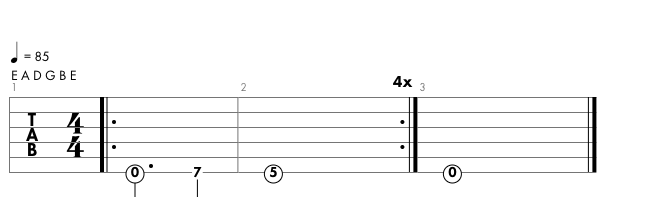

# Baba O'Riley 

<iframe width="560" height="315" src="https://www.youtube.com/embed/rIbMbXjbW98" title="YouTube video player" frameborder="0" allow="accelerometer; autoplay; clipboard-write; encrypted-media; gyroscope; picture-in-picture; web-share" allowfullscreen></iframe>

Riff

Author: The Who 
Rylics: 
Out here in the fields 
I fight for my meals 
I get my back into my living. 
I don't need to fight 
To prove I'm right 
I don't need to be forgiven. 
Yeah, yeah, yeah, yeah, yeah 
Don't cry 
Don't raise your eye 
It's only teenage wasteland 
Sally, take my hand 
We'll travel south cross land 
Put out the fire 
And don't look past my shoulder. 
The exodus is here 
The happy ones are near 
Let's get together 
Before we get much older. 
Teenage wasteland 
It's only teenage wasteland. 
Teenage wasteland 
Oh, yeah 
Its only teenage wasteland 
They're all wasted! 