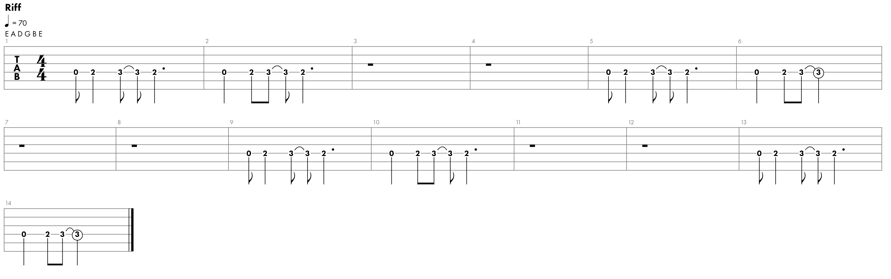

# Another Brick in the Wall

<iframe width="560" height="315" src="https://www.youtube.com/embed/5IpYOF4Hi6Q" title="YouTube video player" frameborder="0" allow="accelerometer; autoplay; clipboard-write; encrypted-media; gyroscope; picture-in-picture; web-share" allowfullscreen></iframe>

Riff

Author: Pink Floyd 
Rylics: 
We don't need no education 
We don't need no thought control 
No dark sarcasm in the classroom 
Teacher, leave them kids alone 
Hey, teacher, leave them kids alone 
All in all, it's just another brick in the wall 
All in all, you're just another brick in the wall 
We don't need no education 
We don't need no thought control 
No dark sarcasm in the classroom 
Teachers, leave them kids alone 
Hey, teacher, leave us kids alone 
All in all, you're just another brick in the wall 
All in all, you're just another brick in the wall 
If you don't eat yer meat, you can't have any pudding 
How can you have any pudding if you don't eat yer meat? 
You! Yes, you behind the bike stands 
Stand still, laddy! 