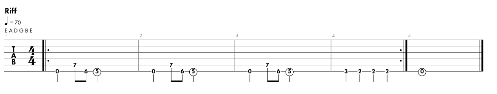

# Enter Sandman

<iframe width="560" height="315" src="https://www.youtube.com/embed/CD-E-LDc384" title="YouTube video player" frameborder="0" allow="accelerometer; autoplay; clipboard-write; encrypted-media; gyroscope; picture-in-picture; web-share" allowfullscreen></iframe>

Riff

Author: Metallica 
Rylics: 
Say your prayers, little one, don't forget, my son 
To include everyone 
I tuck you in, warm within, keep you free from sin 
'Til the Sandman, he comes 
Sleep with one eye open 
Gripping your pillow tight 
Exit light 
Enter night 
Take my hand 
We're off to never-never land 
Something's wrong, shut the light, heavy thoughts tonight 
And they aren't of Snow White 
Dreams of war, dreams of liars, dreams of dragons' fire 
And of things that will bite, yeah 
Sleep with one eye open 
Gripping your pillow tight 
Exit light 
Enter night 
Take my hand 
We're off to never-never land 
Yeah-yeah 
Now, I lay me down to sleep (now, I lay me down to sleep) 
Pray the Lord my soul to keep (pray the Lord my soul to keep) 
If I die before I wake (if I die before I wake) 
Pray the Lord my soul to take (pray the Lord my soul to take) 
Hush, little baby, don't say a word 
And never mind that noise you heard 
It's just the beast under your bed 
In your closet, in your head 
Exit light 
Enter night 
Grain of sand 
Exit light 
Enter night 
Take my hand 
We're off to never-never land (yeah) 
Oh! Yeah-yeah, no 
We're off to never-never land 
Take my hand 
We're off to never-never land 
Take my hand 
We're off to never-never land 
We're off to never-never land 
We're off to never-never land 
We're off to never-never land 