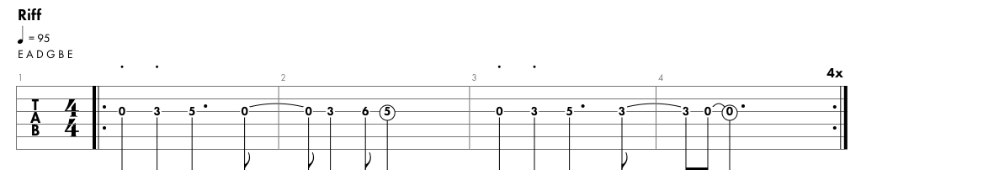

# Smoke on the Water

<iframe width="560" height="315" src="https://www.youtube.com/embed/zUwEIt9ez7M" title="YouTube video player" frameborder="0" allow="accelerometer; autoplay; clipboard-write; encrypted-media; gyroscope; picture-in-picture; web-share" allowfullscreen></iframe>

Riff

Author: Deep Purple 
Rylics: 
We all came out to Montreux 
On the Lake Geneva shoreline 
To make records with a mobile, yeah 
We didn't have much time now 
Frank Zappa and the Mothers 
Were at the best place around 
But some stupid with a flare gun 
Burned the place to the ground 
Smoke on the water, a fire in the sky 
(Smoke) on the water, you guys are great 
They burned down the gambling house 
It died with an awful sound 
Funky Claude was running in and out 
He was pulling kids out the ground now 
When it all was over 
Find another place 
Swiss time was running out 
It seemed that we would lose the race 
Smoke on the water, a fire in the sky 
Smoke on the water 
Burn it down 
We ended up at the Grand Hotel 
It was empty, cold and bare 
The Rolling truck Stones thing just outside 
Huh, making our music there now 
With a few red lights and a few old beds 
We made a place to sweat 
No matter what we get out of this 
I know, I know we'll never forget 
Smoke on the water, a fire in the sky 
Smoke on the water 
(I can't hear anything) 
one more time 
(Smoke on the water) hey! 